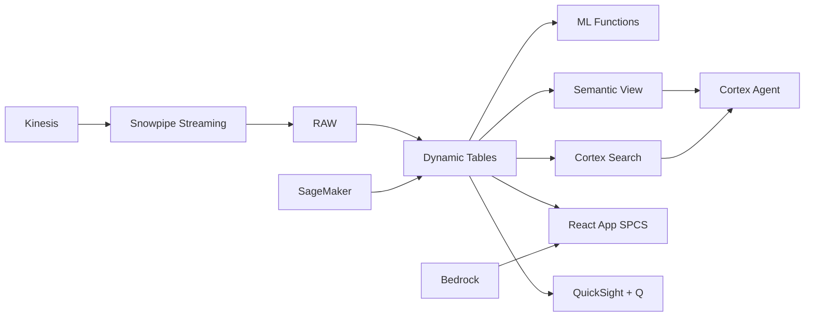

# Consumer Insights & Personalization Engine

110M Filipino internet users, price-sensitive and mobile-first — Snowflake builds consumer profiles with ML.CLASSIFICATION, generates personalized offers via Cortex Complete, and delivers through SES at scale.

## Architecture

Philippine retail is a ₱4.2 trillion market where consumers are mobile-first, price-sensitive, and loyalty-driven. A leading omnichannel retailer with 2.8M customers sends 50M marketing messages monthly — but most are batch, segment-based, and irrelevant. ML-powered personalization with Cortex Complete generates individualized offers that convert 2.4x higher, protecting ₱8.4B in customer lifetime value.



## Snowflake Capabilities

| Capability | Implementation |
|-----------|---------------|
| Dynamic Tables | CUSTOMER_360 / SEGMENT_PERFORMANCE / PRODUCT_AFFINITY / NEXT_BEST_OFFER |
| ML Functions | ML.CLASSIFICATION + ML.CLASSIFICATION |
| Cortex AI | COMPLETE, AI_CLASSIFY |
| Cortex Search | 85000 documents indexed |
| Cortex Agent | PERSONALIZATION_AGENT |
| Semantic View | CONSUMER_ANALYTICS |
| React App (SPCS) | 5 tabs + DemoGuide |


## AWS Services

| Service | Role in Demo |
|---------|-------------|
| Amazon Kinesis | Stream real-time browse and click behavior |
| Amazon Personalize | ML-powered product recommendations |
| Amazon SageMaker | Churn prediction and CLV models |
| Amazon SES | Deliver personalized email campaigns |
| Amazon QuickSight + Q | Marketing analytics dashboard |
| Amazon Bedrock (Claude) | Generate personalized marketing copy |


## Personas

| Persona | Role | Key Questions |
|---------|------|---------------|
| **Clarissa Joy Tan-Cojuangco** | VP Marketing & CRM | "Which customer segment has the highest CLV?" "What's our email campaign open rate by segment?" |
| **Dennis Patrick Soriano** | Personalization Engineer | "What's the click-through rate for ML-personalized vs static offers?" "Which features drive the most predictive lift?" |


## Data

| Table | Rows | Description |
|-------|------|-------------|
| CUSTOMERS | 2,800,000 | Customer profiles with demographics and preferences |
| BROWSE_EVENTS | 45,000,000 | 30 days of browsing behavior from Kinesis |
| PURCHASE_HISTORY | 8,500,000 | 12 months of purchase transactions |
| CAMPAIGN_RESPONSES | 12,000,000 | Email/SMS/push campaign interaction data |
| PRODUCT_CATALOG | 85,000 | Full product catalog with attributes and margins |
| LOYALTY_POINTS | 1,800,000 | Loyalty program activity (earn/burn/tier) |


## Build Instructions

### Prerequisites
- Snowflake account with ACCOUNTADMIN access
- Cortex AI enabled (ML Functions, Search, Agent)
- Warehouse: CONSUMER_WH (Medium)
- AWS CLI with access (us-west-2)

### Deployment

```bash
snowsql -f snowflake/00_setup.sql
snowsql -f snowflake/01_marketplace_install.sql
snowsql -f snowflake/02_raw_tables.sql
snowsql -f snowflake/03_staging.sql
snowsql -f snowflake/04_dynamic_tables.sql
snowsql -f snowflake/05_search.sql
snowsql -f snowflake/06_ml_models.sql
snowsql -f snowflake/07_semantic_view.sql
snowsql -f snowflake/08_agent.sql
```

### React App (SPCS)
```bash
cd app && npm ci && npm run build
docker build -t aws-philippines-retail-personalization-app .
docker push bdiqc8sm-default.registry.snowflakecomputing.com/consumer_insights/app/aws_philippines_retail_personalization/app:latest
```

### Demo Mode
Open the app URL with `?demo=true` for presenter view.

## Build Modes

### Snowflake Only
Run scripts 00-08 (skip AWS-specific integration). Uses:
- **Snowpipe Streaming SDK** instead of Amazon Kinesis
- **ML.CLASSIFICATION + Cortex Complete (native)** instead of Amazon Personalize
- **ML.CLASSIFICATION (native)** instead of Amazon SageMaker
- **Alerts + Notification Integration (Email)** instead of Amazon SES
- **Snowflake Intelligence (Cortex Analyst)** instead of Amazon QuickSight + Q
- **Cortex Complete** instead of Amazon Bedrock (Claude)

### Full AWS + Snowflake
Run all scripts including AWS integration. Deploy QuickSight dashboard from `quicksight/`.

## Business Impact

Industry research and Snowflake customer outcomes:
- **Philippine retail market valued at ₱4.2 trillion with 8% digital commerce penetration** — [PSA Philippines](https://psa.gov.ph/statistics/industry)
- **ML-powered personalization improves campaign conversion 2-4x vs segment-based** — [McKinsey Marketing](https://www.mckinsey.com/capabilities/growth-marketing-and-sales/our-insights)
- **Reducing churn by 5% increases profits 25-95% in retail** — [Bain & Company](https://www.bain.com/insights/the-value-of-online-customer-loyalty/)
- **Filipino consumers rank loyalty programs as #2 purchase decision factor after price** — [Nielsen Philippines](https://www.nielsen.com/apac/en/insights/)
- **Under Armour** (Snowflake customer): serves 1.4B+ data points daily on Snowflake for real-time personalization across 80K+ retail locations -- [snowflake.com/customers/under-armour](https://www.snowflake.com/en/customers/all-customers/case-study/under-armour/)

## Key Demo Numbers

- **2.8M customers** active customer base with unified profiles
- **₱8.4B** CLV at risk from 342K churn-risk customers
- **2.4x** conversion lift from ML-personalized vs static campaigns
- **45M events** browse events ingested monthly via Kinesis
- **₱24,500** average customer lifetime value
- **8.4% CTR** for ML-personalized campaigns (vs 3.5% static)


## License

Apache 2.0 — See [LICENSE](LICENSE) for details.

This is a personal demo project and is not an official Snowflake offering. It comes with no support or warranty.